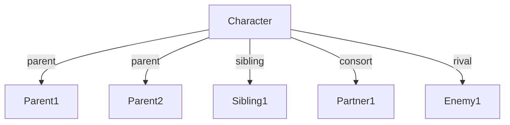

# [Character Name]

## Metadata
```yaml
id: [unique-id]
name: "[Primary Name]"
alternate_names: 
  - "[Name Variant 1]"
  - "[Name Variant 2]"
pantheon: "[Pantheon/Culture]"
type: "[deity|hero|trickster|monster|mortal|other]"
archetype: "[primary-archetype]"
domains:
  - [domain1]
  - [domain2]
status: "[active|inactive|transformed|deceased]"
date_added: "YYYY-MM-DD"
last_modified: "YYYY-MM-DD"
```

## Profile Summary
[Brief 2-3 sentence overview of the character]

## Names & Epithets
- **Primary Name**: [Name] ([Language]: meaning)
- **Epithets**: 
  - [Epithet 1] - [Context/Meaning]
  - [Epithet 2] - [Context/Meaning]
- **Regional Names**: 
  - [Culture]: [Name]

## Physical Description
- **Common Depiction**: [How typically portrayed]
- **Distinguishing Features**: [Unique characteristics]
- **Sacred Animals/Plants**: [Associated life forms]
- **Symbols**: [Items/symbols associated with them]

## Divine/Supernatural Attributes
- **Primary Domain**: [Main area of influence]
- **Secondary Domains**: [Other areas]
- **Powers/Abilities**: 
  - [Ability 1]
  - [Ability 2]
- **Sacred Objects**: [Special items they possess]

## Personality & Character
- **Core Traits**: [trait1, trait2, trait3]
- **Motivations**: [What drives them]
- **Fears/Weaknesses**: [Vulnerabilities]
- **Moral Alignment**: [Good/Neutral/Evil spectrum]

## Mythology & Stories

### Origin Story
[How they came to be]

### Major Myths
1. **[Myth Title]** - [Brief summary and their role]
2. **[Myth Title]** - [Brief summary and their role]

### Key Events
- [Event 1]: [Their involvement]
- [Event 2]: [Their involvement]

## Relationships

### Family
- **Parents**: [Names and relationships]
- **Siblings**: [Names and relationships]
- **Consorts**: [Names and relationships]
- **Children**: [Names and relationships]

### Allies & Associates
- **[Name]**: [Nature of relationship]
- **[Name]**: [Nature of relationship]

### Rivals & Enemies
- **[Name]**: [Nature of conflict]
- **[Name]**: [Nature of conflict]

### Relationship Map


## Cultural Significance

### Worship & Cult
- **Centers of Worship**: [Locations]
- **Festivals**: [Associated celebrations]
- **Rituals**: [How they were honored]
- **Offerings**: [What was given to them]

### Social Role
[What they represented in society]

### Modern Relevance
[How they're viewed/used today]

## Archetypal Analysis

### Primary Archetype
**[Archetype Name]**: [How they embody it]

### Shadow Aspects
[Dark or hidden aspects of their nature]

### Character Arc
[How they evolve through their myths]

## Symbolism

### Associated Symbols
- **[Symbol]**: [Meaning]
- **[Symbol]**: [Meaning]

### Colors
- [Color associations and meanings]

### Numbers
- [Numerical associations]

### Elements
- [Elemental associations]

## Comparative Mythology

### Similar Figures
- **[Culture - Figure]**: [Similarities]
- **[Culture - Figure]**: [Similarities]

### Unique Aspects
[What makes this character distinct]

## In The Mythological Forge

### Narrative Potential
- [How they can be used in new stories]
- [Themes they can explore]
- [Conflicts they can embody]

### Transformative Elements
- [What transformations they represent]
- [How they challenge consciousness]

### Connections to Other Characters
- Links to: [Other characters in the system]

## Media & Representations

### Historical Art
- [Description of ancient depictions]

### Modern Depictions
- [Contemporary representations]

### References
1. [Source citation]
2. [Source citation]

## Tags
`#[tag1]` `#[tag2]` `#[tag3]` `#[tag4]` `#[tag5]`

## Notes
[Additional observations for the Forge project]

---
*Template Version: 1.0*
*For use with The Mythological Forge content management system*