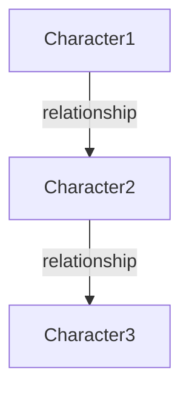

# [Story Title]

## Metadata
```yaml
id: [unique-id]
title: "[Full Title]"
origin:
  culture: "[Culture Name]"
  region: "[Geographic Region]"
  time_period: "[Historical Period]"
  source_text: "[Original Source]"
type: "[creation|hero-journey|transformation|wisdom|apocalyptic|other]"
themes: 
  - [theme1]
  - [theme2]
archetypes:
  - [archetype1]
  - [archetype2]
status: "[draft|review|approved|archived]"
version: "1.0"
date_added: "YYYY-MM-DD"
last_modified: "YYYY-MM-DD"
```

## Summary
[Brief 2-3 sentence summary of the myth/story]

## Full Narrative

### Opening / Setting
[Describe the initial state, world, or conditions]

### Inciting Incident
[What event sets the story in motion?]

### Rising Action
[Key events leading to the climax]

### Climax
[The peak moment of transformation or conflict]

### Resolution
[How the story concludes]

### Denouement
[Final state or lessons learned]

## Characters

### Primary Characters
- **[Character Name]** - [Role/Description]
  - Archetype: [archetype]
  - Key Traits: [trait1, trait2]
  - Transformation: [how they change]

### Secondary Characters
- **[Character Name]** - [Brief description]

### Divine/Supernatural Beings
- **[Entity Name]** - [Role and significance]

## Symbolism & Themes

### Major Symbols
- **[Symbol]**: [What it represents]
- **[Symbol]**: [What it represents]

### Central Themes
1. **[Theme]**: [How it manifests in the story]
2. **[Theme]**: [How it manifests in the story]

### Archetypal Patterns
- [Pattern]: [How it appears]

## Cultural Context

### Historical Background
[Relevant historical/cultural information]

### Religious/Spiritual Significance
[Connection to belief systems]

### Social Function
[What purpose this myth served in its culture]

## Relationships & Connections

### Related Myths
- [Title] - [How it connects]
- [Title] - [How it connects]

### Character Relationships


### Thematic Links
- Links to: [other stories with similar themes]

## Interpretations

### Traditional Interpretation
[Classical understanding]

### Modern Perspectives
[Contemporary readings]

### Psychological/Symbolic Analysis
[Deeper meanings and symbols]

## Variations

### Alternative Versions
- **[Source]**: [Key differences]

### Regional Variations
- **[Region]**: [How it differs]

### Modern Adaptations
- **[Work]**: [How it's adapted]

## Media & Resources

### Visual Representations
- [Image description/location]

### References
1. [Source citation]
2. [Source citation]

### External Links
- [Relevant resource]

## Tags
`#[tag1]` `#[tag2]` `#[tag3]` `#[tag4]` `#[tag5]`

## Notes
[Any additional notes, observations, or connections for the Mythological Forge project]

---
*Template Version: 1.0*
*For use with The Mythological Forge content management system*